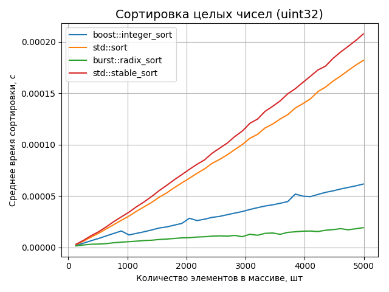

Burst
=====

То, чего нет в Бусте.

  [](https://codecov.io/gh/izvolov/burst) [](https://www.codacy.com/app/izvolov/burst) [](https://wandbox.org/permlink/Hcmx94lZxvWnNfBH)

О проекте
---------

Стандартная библиотека неплоха, но в ней кое-чего не хватает. Поэтому умные люди написали набор библиотек, которые дополняли бы стандартную тем, чего в ней нет.
Однако, и в этих дополнительных библиотеках тоже кое-чего не хватает.

В данном проекте я попытался собрать некоторые алгоритмы и инструменты, совместимые с СБШ и Бустом, которые нужны в повседневной работе, но которых пока нет ни в стандартной библиотеке, ни в библиотеке Boost, либо же они есть, но не устраивают с точки зрения интерфейса или производительности.

Содержание
----------

1.  [Что интересного?](#что-интересного)
    1.  [Целочисленные сортировки](#целочисленные-сортировки)
    2.  [Динамический кортеж](#динамический-кортеж)
    3.  [Ленивые вычисления над диапазонами](#ленивые-вычисления-над-диапазонами)
2.  [Требования](#требования)
3.  [Установка](#установка)
    1.  [Вариант 1: Скопировать исходники](#вариант-1-скопировать-исходники)
    2.  [Вариант 2: Установить с помощью CMake](#вариант-2-установить-с-помощью-cmake)
    3.  [Вариант 3: Подключить папку с проектом в CMake](#вариант-3-подключить-папку-с-проектом-в-cmake)
    4.  [Вариант 4: CMake FetchContent](#вариант-4-cmake-fetchcontent)

Что интересного?
----------------

Полный список интересных штук можно изучить в [справочнике](doc/README.md).

### Целочисленные сортировки

Алгоритмы сортировок стандартной библиотеки `std::sort` и `std::stable_sort` являются классическими представителями сортировок, основанных на сравнениях. В то же время время существует другой класс алгоритмов, применимый к целым числам и не использующий в своей работе сравнения. Таким алгоритмом является [поразрядная сортировка](https://ru.wikipedia.org/wiki/%D0%9F%D0%BE%D1%80%D0%B0%D0%B7%D1%80%D1%8F%D0%B4%D0%BD%D0%B0%D1%8F_%D1%81%D0%BE%D1%80%D1%82%D0%B8%D1%80%D0%BE%D0%B2%D0%BA%D0%B0). И, хотя это такой же классический алгоритм, как, например, быстрая сортировка или сортировка подсчётом, реализации поразрядной сортировки, как правило, оставляют желать лучшего. Возможно, поэтому многие люди до сих пор считают поразрядку алгоритмом, представляющим исключительно академический интерес, и малоприменимым в реальности. Однако, это заблуждение.

Представленная в данной библиотеке реализация поразрядной сортировки существенно быстрее стандартных `std::sort` и `std::stable_sort` (и даже [`boost::integer_sort`](https://www.boost.org/doc/libs/1_71_0/libs/sort/doc/html/boost/sort/spreadsort/integer__idm46709765154208.html)) при условии, что сортируются целые числа или доступно отображение из сортируемых элементов в целые числа.



[Подробнее про `burst::radix_sort` и `burst::counting_sort`](doc/README.md#intsort).

### Динамический кортеж

Представьте, что вам нужно сложить в один контейнер объекты разных типов, при этом набор типов неизвестен на этапе компиляции, а объекты должны быть расположены в непрерывной области памяти и плотно упакованы, то есть между ними не должно быть пустот.

Никакая комбинация стандартных средств (`tuple`, `vector`, `any`) не позволяют добиться требуемого результата.

Поэтому был разработан класс `burst::dynamic_tuple`, удовлетворяющий всем этим требованиям, а соответствие данным требованиям означает оптимальность по занимаемой памяти и времени доступа к нужным объектам.

```cpp
burst::dynamic_tuple t(std::string("123"));

t.push_back(std::vector<int>{1, 2, 3});
t.push_back(true);
t.push_back(123u);

assert(t.size() == 4);
assert(t.get<std::string>(0) == "123");
assert((t.get<std::vector<int>>(1) == std::vector<int>{1, 2, 3}));
assert(t.get<bool>(2) == true);

t.get<unsigned>(3) = 789u;
assert(t.get<unsigned>(3) == 789u);
```

[Подробнее про `burst::dynamic_tuple`](doc/README.md#dynamic-tuple).

### Ленивые вычисления над диапазонами

Периодически возникает потребность в работе с диапазонами как с множествами, то есть производить операции разности, слияния, объединения, пересечения и т.д. Стандартные средства (`std::set_intersection` и т.д.) умеют работать только с двумя диапазонами одновременно, а кроме того, память, в которую будет записан результат, должен быть известен заранее.

В данной библиотеке реализован ряд алгоритмов, каждый из которых работает с произвольным количеством диапазонов, а результатом является ленивый диапазон, который производит нужную операцию (пересечение, слияние и т.д.) "на лету".

Например, следующим образом можно получить пересечение нескольких диапазонов, причём исходные диапазоны могут быть разного типа:

```cpp
auto natural = std::vector<int>{1, 2, 3, 4, 5, 6, 7};
auto   prime = std::list<int>  {   2, 3,    5,    7};
auto     odd = std::deque<int> {1,    3,    5,    7};
//                                    ^     ^     ^

auto intersected_range = burst::intersect(std::tie(natural, prime, odd));

auto expected_collection = {3, 5, 7};
assert(intersected_range == expected_collection);
```

Доступные операции:
1.  [Склейка](doc/README.md#join)
2.  [Слияние](doc/README.md#merge)
3.  [Пересечение](doc/README.md#intersect)
4.  [Полупересечение](doc/README.md#semiintersect)
5.  [Объединение](doc/README.md#union)
6.  [Разность](doc/README.md#difference)
7.  [Симметрическая разность](doc/README.md#symmetric-difference)

[Подробнее про ленивые вычисления над диапазонами](doc/README.md#lazy-ranges).

Требования
----------

1.  Система сборки [CMake](https://cmake.org/) версии 3.8.2 и выше;
2.  Компилятор [GCC](https://gcc.gnu.org/) версии 7.3 и выше или компилятор [Clang](http://clang.llvm.org/) версии 8 и выше\*;
3.  Библиотека тестирования [doctest](https://github.com/onqtam/doctest) \[Не обязательно\*\*\];
4.  Библиотека [Boost](https://www.boost.org/) (модуль [`program_options`](https://www.boost.org/doc/libs/1_62_0/doc/html/program_options.html) \[Не обязательно\*\*\*\]) версии 1.65 и выше;
5.  [Doxygen](http://doxygen.nl) \[Не обязательно\].

Заведомо работающие конфигурации перечислены в [интеграционных скриптах](.github/workflows).

> \*) При работе с идущей в комплекте `libc++` или `libstdc++` версии 7 и выше.

> \*\*) Можно миновать этап сборки и тестирования, если при сборке с помощью `CMake` выключить опцию `BURST_TESTING`:
>
> ```shell
> cmake -DBURST_TESTING=OFF <прочие аргументы ...>
> ```
>
> Также тестирование автоматически отключается в случае, если Burst подключается в качестве подпроекта.

> \*\*\*) `Boost.Program_options` не понадобится, если отключить этап сборки замеров производительности с помощью опции `BURST_BENCHMARKING`:
>
> ```shell
> cmake -DBURST_BENCHMARKING=OFF <прочие аргументы ...>
> ```
>
> Также замеры производительности отключаются в случае, если Burst подключается в качестве подпроекта.

Установка
---------

Возможны следующие варианты установки.

### Вариант 1: Скопировать исходники

Поскольку Burst — полностью заголовочная библиотека, то достаточно скопировать в нужную директорию все заголовки из папки `include` из [репозитория](https://github.com/izvolov/burst) и подключить их в свой проект.

### Вариант 2: Установить с помощью CMake

```shell
cd path/to/build/directory
cmake -DCMAKE_BUILD_TYPE=Release path/to/burst
cmake --build . --target install
```

После этого в системе сборки CMake будет доступен пакет `Burst`:

```cmake
find_package(Burst)
```

Эта команда породит интерфейсную библиотеку `Burst::burst`, которую можно использовать при подключении библиотек:

```cmake
add_executable(program program.cpp)
target_link_libraries(program PRIVATE Burst::burst)
```

### Вариант 3: Подключить папку с проектом в CMake

```cmake
add_subdirectory("path/to/burst")
```

После этого в системе сборки CMake будет доступна цель `Burst::burst`, которую можно использовать при подключении библиотек:

```cmake
add_executable(program program.cpp)
target_link_libraries(program PRIVATE Burst::burst)
```

### Вариант 4: CMake FetchContent

Начиная с версии CMake 3.14 можно скачать и подключить репозиторий с зависимостью прямо во время сборки с помощью модуля [FetchContent](https://cmake.org/cmake/help/v3.14/module/FetchContent.html). В случае с библиотекой `Burst` это можно записать тремя командами:

```cmake
include(FetchContent)
FetchContent_Declare(Burst GIT_REPOSITORY https://github.com/izvolov/burst.git)
FetchContent_MakeAvailable(Burst)
```

Этот набор команд породит интерфейсную библиотеку Burst::burst, которую можно использовать при подключении библиотек:

```cmake
add_executable(program program.cpp)
target_link_libraries(program PRIVATE Burst::burst)
```
